# Vashtastic: A Simple and Cool Meshtastic Node

## 10-July-2026

### The Start:

Vashtastic is a Meshtastic Node which you can carry in your Pocket. For those who Don't know what a Meshtastic Node is, It's a Device which has the ability to Talk to other devices without using Internet, it does this by Blasting Radio Waves in the Sky so other Devices can hear it and connect to it. This Device would help you connect and talk with your Friends without Internet (Both Should have this device). and now for the Nerds. I'm using an **ESP32-S3-WROOM-1 Micro-controller** which is wired to multiple Components such as:

- A GPS (Quectel L76K)
- RF Transciever-LoRa (E22-900M22S)
- E-ink Display (Waveshare 2.9In)
- An LDO (ME6211C33M5G)
- Battery Charger (TP4056)
- USB-C
- MOSFET (for GPS, so it doesn't always be ON)

These Components will be connected to the ESP32. I have also Added Capacitors and Resistors to every Components which require it. Vashtastic will be a Compact and Small Device, so a 2.9In Screen is Perfect for that. One more Thing I'm going to add is a Map, which points the Location of other Nodes in the area. This way You can Track Where your Friends are. The Reason I have Chosen E-Ink Display is because It takes Almost no Power After it has Drawn the Picture/Map etc. and Also because it Looks cool. I have Only done Research as of Now and will start working on the Project from tomorrow.

## 11-July-2026

### Starting the Schematic:

- **ESP32-S3-WROOM-1:** 

The First I had to Find was the Strapping pins of the ESP32 from the datasheet, and to research what each Pin Does. I looked up the Datasheet and Looked through it and Found what i was looking for. the Strapping Pins of ESP32 are GPIO-0, GPIO-3, GPIO-45 and GPIO-46. Since I'm using EasyEDA so it was easy to find the Component in the library. now i had to find all the other components and place those.

- **E22-900M22S:**

This is one of the Main Core Components of this device, it is the Module which sends Radio Waves into the Sky, it has pretty Long Range (LoRa). About 7-8 Km. its a Module which connects to the ESP32 and sends Radio data via the SPI pins. It was Pretty Easy to wire because I had already Used a Similar Module in my previous PCB (Bebop). The one I used before was called LoRa-RFM95W, which is also pretty good. Well I placed the component and wired the SPI pins to the GPIO pins of ESP32.

- **Quectel L76K:**

This is the GPS module so that the Map works flawlessly, it will get the Coordinates and send them to the ESP32, which would then be sent to the E-ink display to Point the Coordingates on the Map. I would have to use the Open-Source Meshtastic Firmware. But thats for Later.

- **ME6211C33M5G:**

This is an LDO, which gets the current from the Battery and Converts it to a Smooth 3.3V for all the Components. Without this, the Device wouldn't work.

- **TP4056:**

This is the Li-ION Battery Charger, without this, if a person would try to charge the battery through the USB-C port, the Battery would either catch fire or Explode, or Both. This Battery Charger takes the Current and Charges the Battery so it doesn't explode or stuff. 

- **USB-C:**

Not much to say about this tbh, its a USB-C port. it connects to the Battery Charger.

- **E-Ink Display:**

This is the Cool Display, the module I used has 8 pins and the entire pre-soldered board connects to the pins easily.

I placed all the components and wired the power system first. the power works like this. you plug in the USB-C and the Power goes through the Battery charger first which makes the Voltage good for the battery, the battery charges and then the battery is connected to the LDO, which regulates the battery voltage to a smooth 3.3V for all the components, and then finally all the components are wired to the LDO.

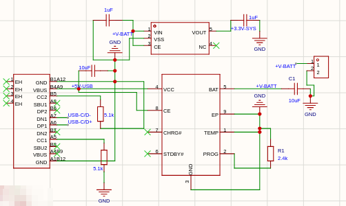

 After the Power systerm, i worked on the ESP32 and the Radio Module. Like i said before that it was pretty easy because you just have to match the pins and wire each on of them, the DIO1 pin can be wired to any GPIO pin i think, and you leave the DIO2 pin floating or put a No connect flag on it.

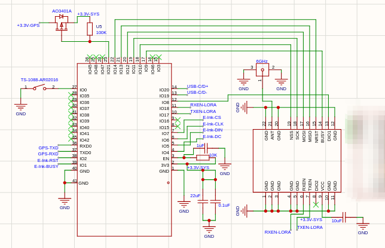

 After the wiring is complete for the Radio modulle and ESP32, then you can work on wiring the GPS and E-ink display to the Micro-controller. For the GPS, I added a MOSFET so that GPS is not always turned ON and sips power, so i connected the mosfet to the 3.3V and then the drain is connected to the GPS, i also added a 100K ohm resistor so the GPS doesn't take any power. The wiring for the GPS was easy because you only have to wire 6-7 (no please) pins. i should probably give space between things mb.Oh yeah i also made a silly mistake of connecting the TXD and RXD pins to the TXD and RXD pins of the ESP-32, i basically matched and wired it too but they have to be connected to each other for example, TXD should connect to RXD and vice versa.

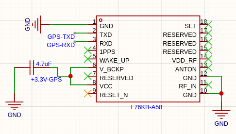

 Now it was time to wire up the E-ink display. the first problem i had was that i couldn't find the module in the library, but i found out that it was in the user contributed tab. people had made the mmodule available. good people. Since the module only has 8 pins, i connected each pin to the micro-controller's gpio pins and it was done. 

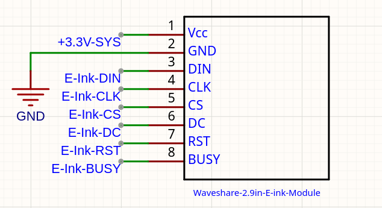

 I also added alot of capacitors and resistors according to the datasheet of each component.

 After this I was finished with the Schematic. now the hard part is the PCB layout, which i will do tomorrow or after 5 minutes (its 11:55PM rn). After wiring everything up, here's the Schematic:

 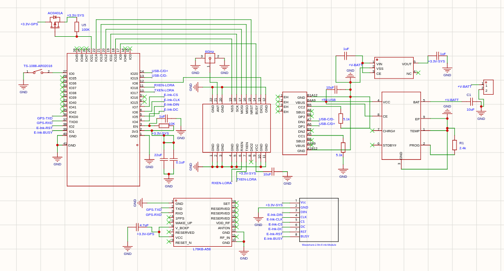

 I also added a no connect flag on everything which was not connected. I have a headache right now but i have to complete 84 hours. and i only have 20 days left. I'm so cooked man. I did 5 hours today which is not bad but i need to do 10 hours tomorrow.

## 12-July-2026 - 13-July-2026

### Combined Journal of Last two days cuz I forgot to write the Journal (again)

Ok so I started working on the PCB on the 12th. First thing i had to do was place the components in such order that the ratlines are straight and short as possible.

- **Placement of ESP32:**
 I placed the Esp32 in the far right with its squigly antenna (the wifi and bluetooth part) is hanging outside the board. Why did I do this?, because the wifi and bluetooth signals would be interupted/absorbed or whatever its called by the ground plane below it, the ground plane acts like a a shield for the wifi/bluetooth signal. so to fix that, i just moved the wifi part to hang outside the board, there is another way which works by idk adding vias and stuff but a man said **"if it ain't broke, don't fix it"**. I also put the resistors and capacitors for the esp32 as close as possible to the pins of esp32.

- **Placement of the Power System and the USB-C:**
I placed the power system and the USB-C on the Bottom far left, as close as possible to the board outline. First i placed the battery charger, usb-c and then the LDO. All the required resistors and capacitors were placed as close as possible to the pins.

- **Placement of the LoRa Module:**
The LoRa Module was placed in the top left corner and the U.F.L connector was as close as possible to the pin 21 (the antenna pin) of LoRa module. the traces must also be thick, approximately 0.6mm. All the required resistors and capacitors were placed as close as possible to the pins.

- **Placement of the GPS Module:**
The GPS module was placed in the top right corner, right beside the Lora Module. And then the MOSFET was placed in between the ESP32 and the GPS for easier and short traces. All the required resistors and capacitors were placed as close as possible to the pins.

**All the components and resistors except the E-ink display were placed on the Bottom Layer. and the Display is Placed on the Top Layer.**

- **Placement of the E-Ink display:**
The E-Ink Display I chose is a module created by the Waveshare Company, It has all the things pre-soldered and i just have to mount it and connect the 8 Pins to the LDO/ESP32. The E-Ink Display is 2.9 Inch Diagonally. But the whole mount and everything is about 89.50mm by 38.00mm. The main goal is to make this device as easy as possible to reproduce so I have to choose stuff which even non-hardware people can do. 

After Placing everything, I wired each component to its respective capacitors and resistors. The first thing i traced was the power system, First i connected the battery charger, the usb and then the LDO. Tracing is always the fun part for me, I JUST LOVE IT SO MUCH MAN. 

After tracing the Power Sytem, i wired the LDO 3.3V output to the ESP32 chip and then from ESP32 to every other component. I traced everything to the esp32 and the wiring was done. Here's how it looks after tracing everything:

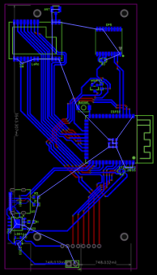

I also didn't trace any GND Pins because i planned to use the ground plane.

### 13-July-2026

**THE DESIGN HAD SO MANY PROBLEMS**:

- **E-Ink Display Mistake:**
Idk what i was thinking but i put the e-ink display on the right side, which is an awfully bad design, like bruh it would feel so weird. So i had to move the USB-C and the Entire Power System to the Right And move the Display to the left. i also had to lookout for the mounting holes bruh. Well I moved it and wired the 8 pins and the power system again. and this is how it looks:

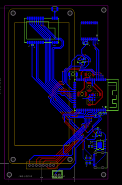

- **USB-C Flaw:**
I posted the Routing Picture to the hardware channel and one guy name @yam found a crucial flaw. I HAD THE USB-C BACKWARDS, AND I WAS THINKING THAT IT WAS DESIGNED THIS WAY BRUH. in the picture above it is fixed but the picture before this has the fault if you want to look at it.

Well That was it for Routing, Now it was time for **MAKING IT COOLER**.

### THE "MAKING IT COOLER" PART:

Now you might be wondering, "why is it named "Vashtastic"?". Well Vash is a Character from an anime called Trigun.

Well the anime is pretty peak, so i had to design the pcb around that vibe. Since EasyEDA makes it harder to add custom fonts, you have to use images, even for text. i just basically find the font i want to use and preview the text in the broswer and take a screenshot, and then paste it on the PCB. well after adding all the silkscreen stuff. here's how it looks:

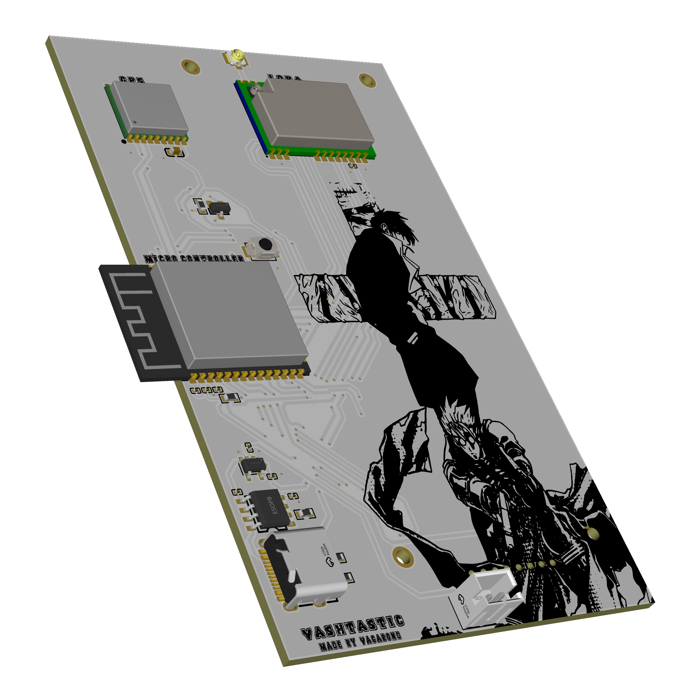

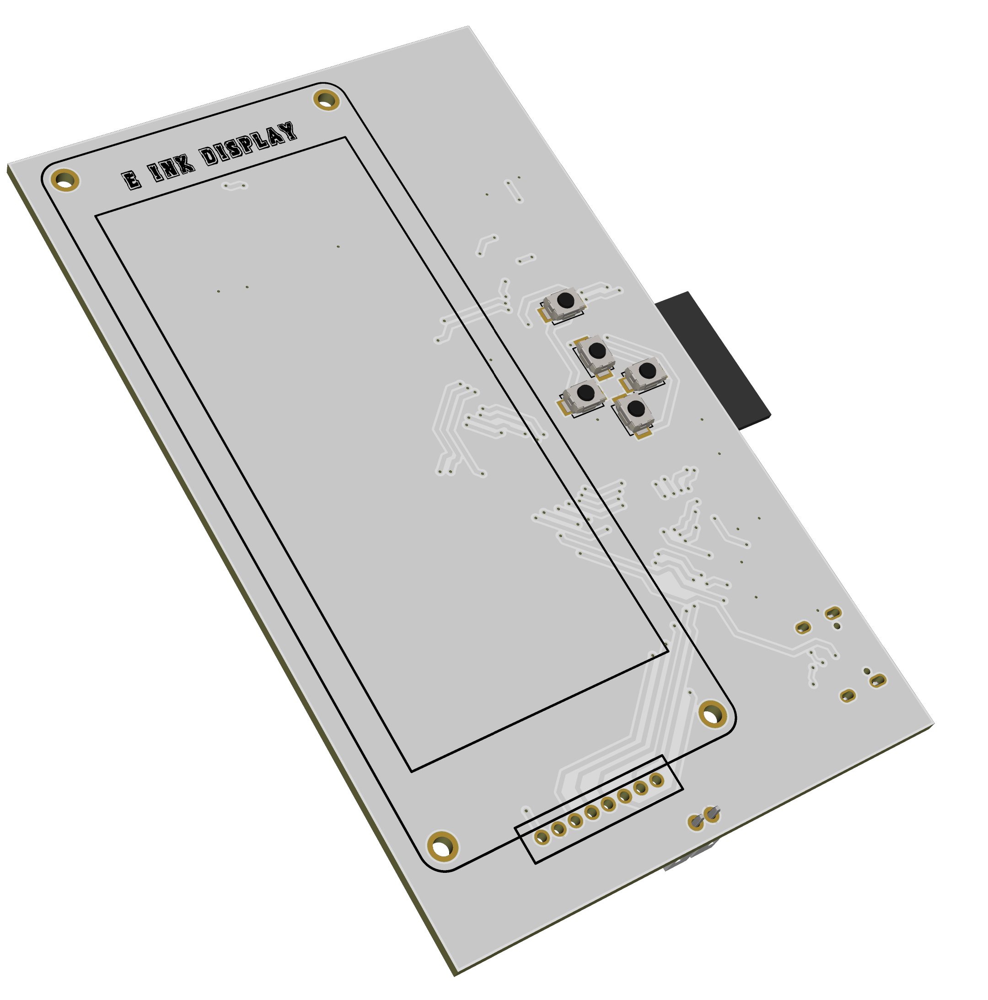

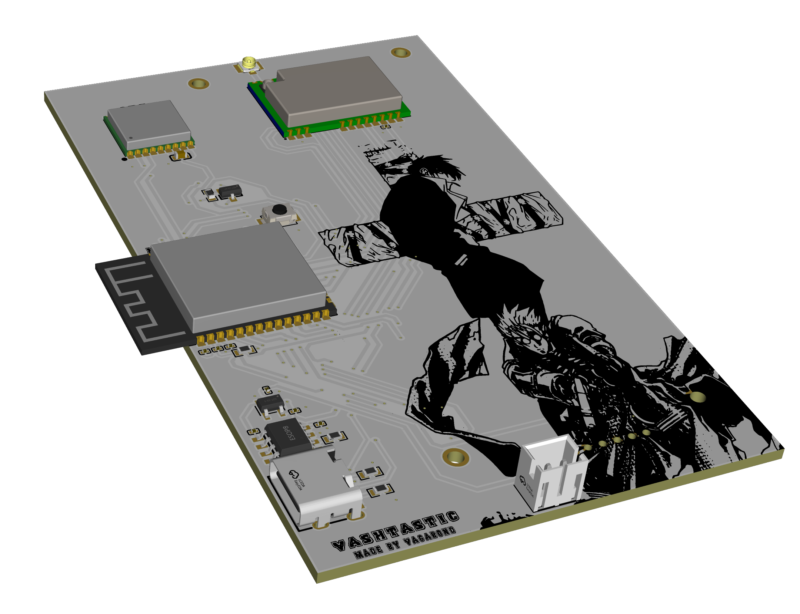

I'm very happy with the design and finally done with the PCB. now I'll work on the Case for this.

I worked on the Case today too, about 4 hours but Lapse and Lookout wasn't working and i lost the 4 hours. I'd be very pleased if you can add those 4 hours.

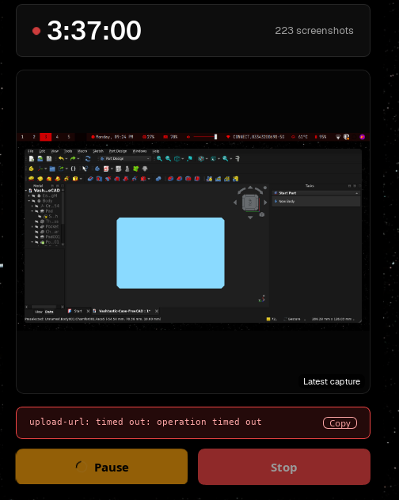

If you don't believe me then look up the messages on the 13th-July in the Lapse-help channel. alot of people were having this problem. and i don't think I'll get my hours back. Well that's it for today.

***See you Space Cowboy***

## 14-15 July-2026 (I don't like journaling man)

### This is a Combined Journal (again).

### The Case:

on the 13th July, I started working on the Case for Vashtastic. and Today I worked on it more and completed the Case. I added alot of stuff today. Screw holes, Buttons, the back shell, battery hole and ALOT of stuff. It was my first time using FreeCAD and i was in the flow state fr. Like I just rawdogged everything so fast. even i was surprised. I went for the Clamshell design, four screws on the corners and viola, its completely shut. I had to add battery in it too so I had to make a hole in the Back shell. Lets go one by one ig.

- **Back-Shell:**
For the Backshell, since it has to be the same height and width, I just looked up the measurements of the top shell and Copy pasted it. and padded it by 15mm. and the Back shell was done.

- **Screw-Holes:**
Well I used the M3 Screws for this and made the screw hole according to that. I looked up how screws even work and found out that you have to make the Hole bigger on the start and smaller on the end. Well i did just that and added holes on each corner of the back shell. 

- **Battery Pouch or hole:**
I made a square on the back shell and padded it according to the batteries I'm going to use and those are 18650 cell. it is just going to be 1 cell. so after Padding that much i then made a Pocket/hole within that square and the battery pouch was done. I also had to make an empty square in the pouch/hole. that hole was for the wires and connector. the wires will go through that hole and connect with the pcb. I also had to design a cover for this batter pouch. so what i did is I sketched/padded a square the length of the battery pouch with 0.4mm tolerance and then i made 2 screw hole. one in the top left and one in the bottom right corner. And I was done with the battery Pouch. With this the backshell was done.

- **Adding Buttons:**
Since I made a D-Pad and a Zoom button on the PCB. i had to design it too obviously. But I had no Idea how buttons work. So i researched about this. and I found out that you have to make a circle the length of the hole but slightly smaller so it fits and make it as deep as the hole is. then you sketch a wider circle. wider than the hole so it gets stuck and doesn't fall off. and at the end you just sketch a circle underneath that is just small enough and exact size of the button on the pcb. and pad it as close as possible to button. Well that was and the math is same for every button so i built the dpad buttons after this pretty easily.  After that i was done with the buttons. 

- **Antenna Hole:**
I added a U.Fl Connector on the pcb so i had to make a hole for the antenna as well. I went for the U.FL to SMA connector. it is a wire which connects to my pcb ufl connector and the antenna would connect to the SMA connector. And since its a wire, i can put the hole anywhere (it still has to be close enough to the LoRa module otherwise, as far as you make the hole from the module, you lose the range and transmitting power or shi. in short its bad). so keep it under 3cm. well since my case was short i just put the hole in the corner like its supposed to be and I made the hole big enough (about 7mm) and I was done with Antenna stuff.

After doing all that, the Case was finished. and Here's how it looks:

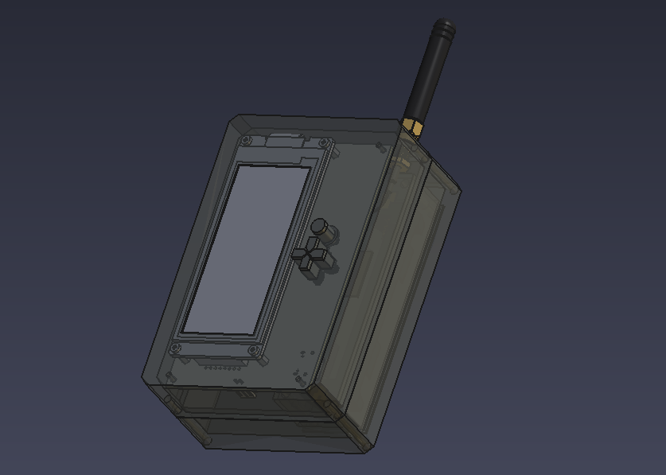

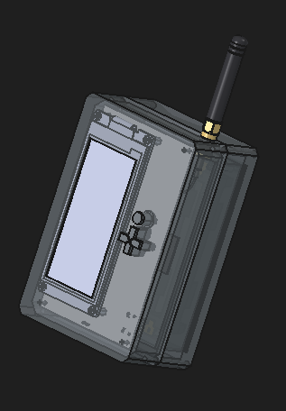

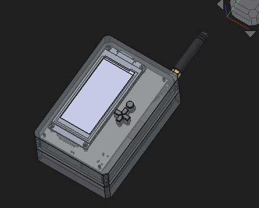

**I cooked so hard man.**

Well that was it for today.

***See you Space Cowboy***

## 15-July-2026. (the last one I think)

