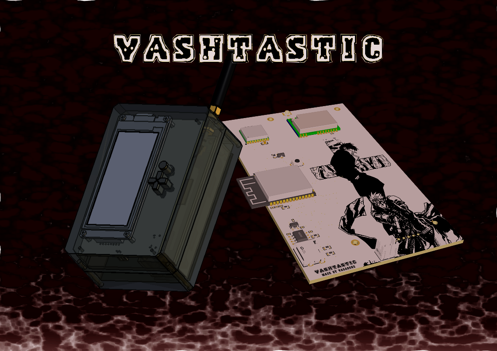
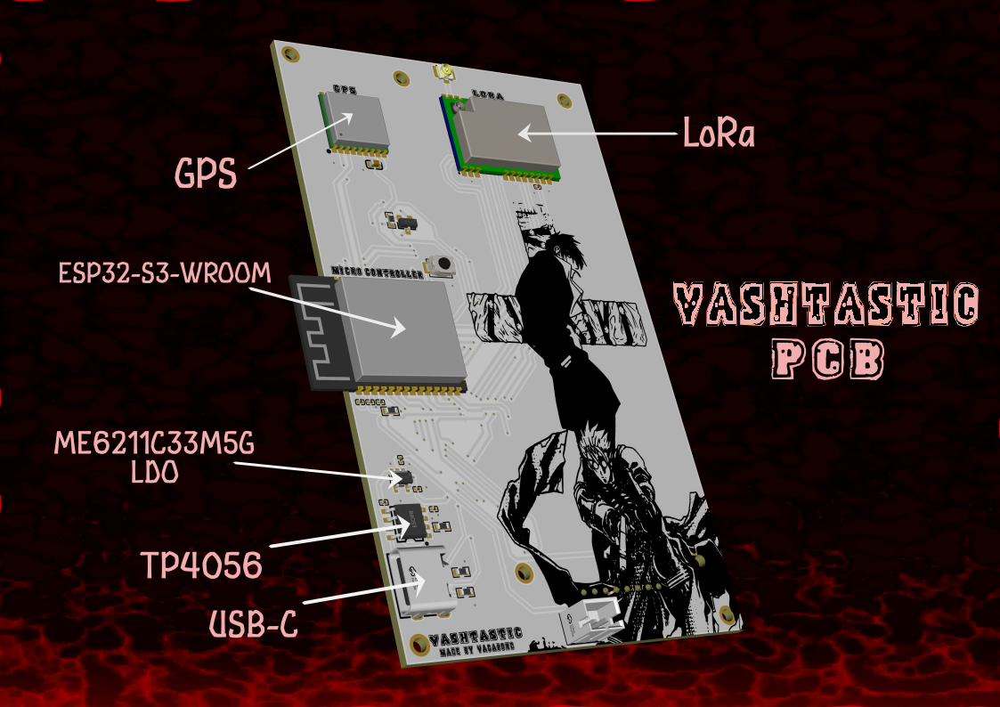
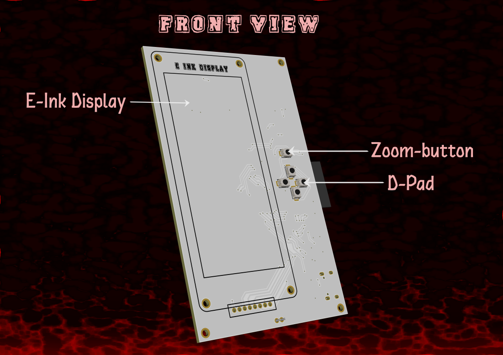
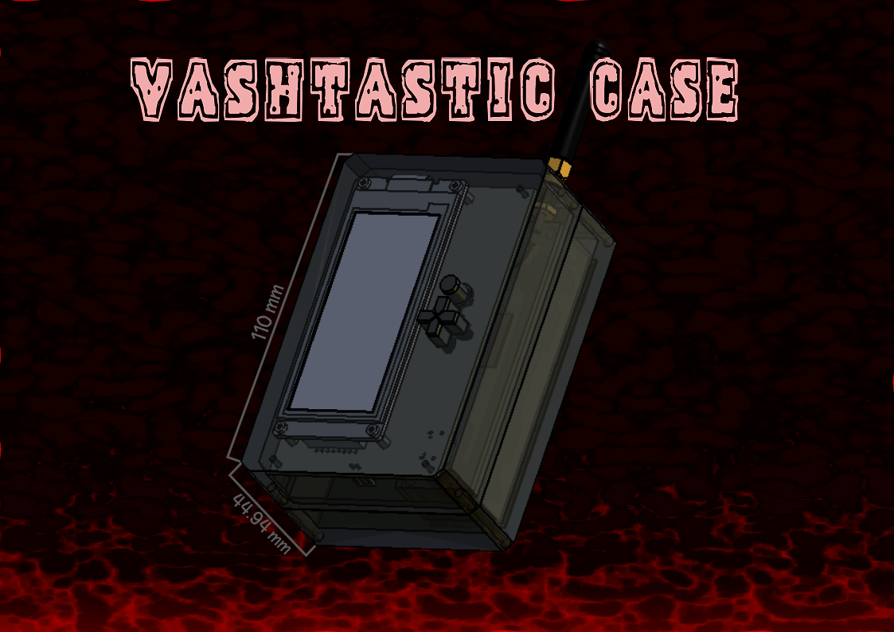

[![Contributors][contributors-shield]][contributors-url]
[![Forks][forks-shield]][forks-url]
[![Stargazers][stars-shield]][stars-url]
[![Issues][issues-shield]][issues-url]
[![Unlicense License][license-shield]][license-url]

 

  
  <h3 align="center">Vashtastic</h3>

  

    A Cooler Meshtastic Node
     
     
    <a href="https://github.com/TrulyVagabond/Vashtastic/blob/main/JOURNAL.md">Journal</a>
    &middot;
    <a href="https://github.com/TrulyVagabond/Vashtastic/issues">Report Bug</a>
    &middot;
    <a href="https://github.com/TrulyVagabond/Vashtastic/issues">Request Feature</a>
  

## What is Vashtastic?

Vashtastic is an off-grid communication terminal. This Project integrates a Custom Printed Circuit Board (PCB) with a Heavily Customized 3D-printable enclosure. Designed to Operate Completely Independent of cellular networks and Wi-Fi, Vashtastic Leverages Long Range (LoRa) Radio Frequencies to send and receive data across Vast distances. It is basically a way of communication without internet.

### Built With

* [![EasyEDA][EasyEDA]][EasyEDA-url]
* [![FreeCAD][FreeCAD]][FreeCAD-url]
* [![Inkscape][Inkscape]][Inkscape-url]

## Getting Started

To get Your own Vashtastic, you need three things.

- PCB
- 3d-Printed Enclosure
- Money

### Ordering the PCB

1. Navigate to the Gerber Files in the **"Gerber"** Folder. 

2. Download the ".zip" File

3. Upload this '.zip' file to a custom PCB manufacturer (Like PCBWay, OSH Park or JLCPCB)

4. Standard Manufacturing Settings (1.6mm thickness, HASL finish) work Perfectly for this Board.

### 3D Printing the Enclosure

1. Navigate to the **"CAD"** folder.

2. Download any of the File Formats and Upload it into your Desired 3D slicing Software.

3. Use a durable, temperature-resistant filament like **PETG or ABS**. Set your wall thickness to at least 4 perimeters for high structural strength.

4. **Important**: Print the D-pad and Zoom buttons with the flat "cap" face pointing UP, and enable supports for the internal flanges.

## Bills Of Materials (BOM)

| Name of Component            |   Quantity | Price   | Manufacturer   | Mfr Part #                 | Footprint                                        | Supplier       | Supplier Part   | Comment                      |
|:-----------------------------|-----------:|:--------|:---------------|:---------------------------|:-------------------------------------------------|:---------------|:----------------|:-----------------------------|
| 10uF                         |          3 | $0.10   | -              | -                          | C0201                                            | DigiKey/Mouser | -               | 10uF                         |
| 1uF                          |          3 | $0.10   | -              | -                          | C0201                                            | DigiKey/Mouser | -               | 1uF                          |
| 22uF                         |          1 | $0.12   | -              | -                          | C0201                                            | DigiKey/Mouser | -               | 22uF                         |
| 0.1uF                        |          1 | $0.10   | -              | -                          | C0201                                            | DigiKey/Mouser | -               | 0.1uF                        |
| 4.7uF                        |          1 | $0.10   | -              | -                          | C0603                                            | DigiKey/Mouser | -               | 4.7uF                        |
| B2B-PH-K-S(LF)(SN)           |          1 | $0.15   | JST            | B2B-PH-K-S(LF)(SN)         | CONN-TH_B2B-PH-K-S                               | DigiKey/Mouser | C131337         | B2B-PH-K-S(LF)(SN)           |
| ME6211C33M5G-N               |          1 | $0.25   | MICRONE(南京微盟)  | ME6211C33M5G-N             | SOT-23-5_L3.0-W1.7-P0.95-LS2.8-BL                | DigiKey/Mouser | C82942          | ME6211C33M5G-N               |
| AO3401A                      |          1 | $0.20   | AOS            | AO3401A                    | SOT-23_L2.9-W1.3-P1.90-LS2.4-BR                  | DigiKey/Mouser | C15127          | AO3401A                      |
| 2.4k                         |          1 | $0.10   | -              | -                          | R0603                                            | DigiKey/Mouser | -               | 2.4k                         |
| 5.1k                         |          2 | $0.10   | -              | -                          | R0603                                            | DigiKey/Mouser | -               | 5.1k                         |
| 10K                          |          1 | $0.10   | -              | -                          | R0603                                            | DigiKey/Mouser | -               | 10K                          |
| 6GHz                         |          1 | $0.35   | HOAUC(华宇创)     | HYCW26-RF3031-125B         | IPEX-SMD_3P-L2.6-W2.6-LS3.0_MHFIANTENNACONNECTOR | DigiKey/Mouser | C53058956       | 6GHz                         |
| Button                       |          1 | $0.20   | XUNPU(讯普)      | Button                     | SW-SMD_L3.9-W3.0-P4.45                           | DigiKey/Mouser | C720477         | Button                       |
| TS-1088-AR02016              |          5 | $0.20   | XUNPU(讯普)      | TS-1088-AR02016            | SW-SMD_L3.9-W3.0-P4.45                           | DigiKey/Mouser | C720477         | TS-1088-AR02016              |
| 2.4GHz                       |          1 | $4.50   | ESPRESSIF(乐鑫)  | ESP32-S3-WROOM-1-N8R2      | WIRELM-SMD_ESP32-S3-WROOM-1                      | DigiKey/Mouser | C2913204        | 2.4GHz                       |
| TP4056-42-ESOP8              |          1 | $0.25   | TOPPOWER(南京拓微) | TP4056-42-ESOP8            | ESOP-8_L4.9-W3.9-P1.27-LS6.0-BL-EP               | DigiKey/Mouser | C16581          | TP4056-42-ESOP8              |
| E22-900M22S                  |          1 | $6.50   | EBYTE(亿佰特)     | E22-900M22S                | WIRELM-SMD_E22-900M22S                           | DigiKey/Mouser | C411293         | E22-900M22S                  |
| L76KB-A58                    |          1 | $5.50   | Quectel(移远)    | L76KB-A58                  | GPSM-SMD_18P-L10.1-W9.7-P1.10                    | DigiKey/Mouser | C2916234        | L76KB-A58                    |
| 100K                         |          1 | $0.10   | -              | -                          | R0603                                            | DigiKey/Mouser | -               | 100K                         |
| Waveshare-2.9in-E-ink-Module |          1 | $16.99  | waveshare      | 2.9inch e-Paper Module (B) | WAVESHARE-2.9IN-EINK-MODULE                      | Amazon         | -               | Waveshare-2.9in-E-ink-Module |
| TYPE-C-31-M-12               |          1 | $0.45   | 韩国韩荣           | TYPE-C-31-M-12             | USB-C_SMD-TYPE-C-31-M-12_1                       | DigiKey/Mouser | C165948         | TYPE-C-31-M-12               |
| **TOTAL COST** | | **$37.76** | | | | | | |

## Assembling Vashtastic

- **PCB Assembly:**

   1. You can Either Order the PCB pre-soldered from Manufacturers. or you can Solder on your own. See the PCB layout for Soldering. 

  2. After Soldering and getting the PCB ready, you just have to attach the U.FL to SMA Cable to the PCB and the Antenna and Screw in the E-ink Display.

  3. After Doing all that, Your PCB would finally be ready.

- **Case Assembly:**

  1. 3D Print the Enclosure with the Specified Settings Above.

  2. You Must 3D print the Front and Back Shell Separately. The Front Shell Contains the Holes for the Buttons and E-ink Display. The Back Shell Contains a Space for the Battery Sled to go in and a Hole For Smooth Connection between the Battery and the Connector on the PCB (JST connector)

  3. Put the Antenna Through the Hole in the Enclosure.

  4. Add the buttons in the Desired hole Created in the Enclosure Before Closing it shut.

  5. After Adding the battery in the Back Shell and Covering it with the Battery Cover. Use **M3 Screws** to Screw in everything, The Front Shell and Back Shell, and the Battery Cover. 

  6. Your **Vashtastic** is Ready to Use.

#### 
Note: This Repo Does Not Contain the Firmware. Add the Firmware On Your Own.

## Using Vashtastic

Vashtastic Comes in 2 types of Usage. You can flash the Required Firmware and then you can use the:

  1. Maps Layout
  2. Normal Meshtastic Layout

### Maps Layout:

The Maps Layout is the Intended way to use Vashtastic. You can Add Your Friends Device in the **"Normal Meshtastic Layout"** and then when you switch to the Maps Layout You can see the Exact Coordinates of Your Friend's Device. and Communicate with him From Vast distances
(20+ Km)

Use the Buttons to Navigate the E-Ink Display. 

- **D-Pad**:
Use the D-Pad to navigate the display by pressing the Buttons for the Intended Direction. Cmon bruh You've a use a D-pad before.

- **Zoom-Button**:
Use the Circular Button above the D-Pad to Zoom into the Map.

### Normal Meshtastic Layout: 

Use this to add Your Friends and Setting up the Device. Check **Meshtastic Repo** for More Information.

## Contributing:

You can Contribute by Writing the Firmware for me HAHA. or Making Awesome Changes to the Case.

## Special Thanks:

- **FreeCAD** for the Amazing 3D Modeling Free Software.

- **EasyEDA** for the Amazing PCB Designing Free Software.

- **Hack Club** for making me Motivated enough to make this haha.

## License

This Project is Distributed Under MIT License. Check License.txt for More Information.

 

###### Note: A.I was only used for Research Purposes. 

  
